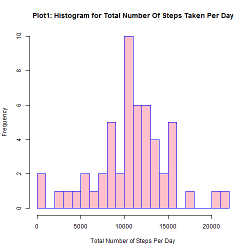

* * * *
####  Introduction 
* * * *
    This assignment makes use of data from a personal activity monitoring device.
    This device collects data at 5 minute intervals through out the day.
    The data consists of two months of data from an anonymous individual collected during the months of October and November, 2012 and include the number of steps taken in 5 minute intervals each day.


* * * *
####  Dataset : ["Activity monitoring data.zip"](https://d396qusza40orc.cloudfront.net/repdata%2Fdata%2Factivity.zip")
* * * *
    1: Dataset File size = 53Kb with 17568 rows and 3 cols
    2: In this dataset missing values are coded as 'NA'
    3: The file has a header row.

    Variables in this dataset are as foll:
    
    1. "steps": Number of steps taking in a 5-minute interval (missing values are coded as NA)
    2. "date": The date on which the measurement was taken in YYYY-MM-DD format
    3. "interval": Identifier for the 5-minute interval in which measurement was taken
    

* * * *
####  Step 1: Preparing the Environment
* * * *


```r
#    Set Global Options "echo =TRUE"" so that the code chunks in R Markdown is readable by peers.
    library(knitr)
    opts_chunk$set(echo = TRUE,fig.path='./figures/')
```
    

```r
#     Set your current working directory
#     setwd("C:/Users/XYZ/Desktop/RepData_PeerAssessment1")
# 
#     Fork/clone the GitHub repository created for this assignment.
#       cd "to your current working directory"
#       git clone https://github.com/rdpeng/RepData_PeerAssessment1.git
```


```r
    # Install the foll packages and load the libraries
    
#     library(knitr)        # Useful for uploading the assignment
#     library(lubridate)    # Useful for Converting variables to Date/Time classes
#     library(ggplot2)      # Useful for Plotting Figures
#     library(lattice)      # Useful for Plotting Figures
#     library(dplyr)        # Useful for performing computations
```

* * * *
####  Step 2: Downloading and Unzipping the dataset
* * * *


```r
#    library(util)
#   if(!file.exists("repdata-data-activity.zip")) {
#     
#     tmp <- tempfile()#create name for the temporary destination file
#     download.file(url = "http://d396qusza40orc.cloudfront.net/repdata%2Fdata%2Factivity.zip",destfile =tmp)
#      #Note: use method = "curl" for Mac 
#     file <- unzip(tmp)#extracting the zipped file 
#     act <- read.csv("activity.csv")
#     unlink(tmp) #delete the tmp file
 # }
```

* * * *
####  Step 3: Reading the data
* * * *


```r
act <- read.csv("activity.csv",header = TRUE,colClasses = c("numeric","character","numeric"))
```

    Inspect the dataset for its dimensions,structure,properties and summary.


```r
dim(act) # 17568 obs / 3 variables ie "steps","date","interval"
```

```
## [1] 17568     3
```

```r
str(act) # "date" field is character
```

```
## 'data.frame':	17568 obs. of  3 variables:
##  $ steps   : num  NA NA NA NA NA NA NA NA NA NA ...
##  $ date    : chr  "2012-10-01" "2012-10-01" "2012-10-01" "2012-10-01" ...
##  $ interval: num  0 5 10 15 20 25 30 35 40 45 ...
```

```r
summary(act) # NA's in "steps" = 2304 and no NA's for "date" & "interval"
```

```
##      steps            date              interval     
##  Min.   :  0.00   Length:17568       Min.   :   0.0  
##  1st Qu.:  0.00   Class :character   1st Qu.: 588.8  
##  Median :  0.00   Mode  :character   Median :1177.5  
##  Mean   : 37.38                      Mean   :1177.5  
##  3rd Qu.: 12.00                      3rd Qu.:1766.2  
##  Max.   :806.00                      Max.   :2355.0  
##  NA's   :2304
```

```r
head(act,10) # data from the first 10 rows
```

```
##    steps       date interval
## 1     NA 2012-10-01        0
## 2     NA 2012-10-01        5
## 3     NA 2012-10-01       10
## 4     NA 2012-10-01       15
## 5     NA 2012-10-01       20
## 6     NA 2012-10-01       25
## 7     NA 2012-10-01       30
## 8     NA 2012-10-01       35
## 9     NA 2012-10-01       40
## 10    NA 2012-10-01       45
```

* * * *
#### Step 4: Pre-processing/Transforming the data
* * * *

    "date" field represents Dates in string character format,so we convert it into Date class  
    "interval" field represents time in numeric format(HHMM = Hours Minutes) so we convert it into factor class


```r
act$date <- as.Date(act$date, format = "%Y-%m-%d")
act$interval <- as.factor(act$interval)
```

    After formatting,check the properties of the dataset. 


```r
str(act)
```

```
## 'data.frame':	17568 obs. of  3 variables:
##  $ steps   : num  NA NA NA NA NA NA NA NA NA NA ...
##  $ date    : Date, format: "2012-10-01" "2012-10-01" ...
##  $ interval: Factor w/ 288 levels "0","5","10","15",..: 1 2 3 4 5 6 7 8 9 10 ...
```

```r
summary(act)
```

```
##      steps             date               interval    
##  Min.   :  0.00   Min.   :2012-10-01   0      :   61  
##  1st Qu.:  0.00   1st Qu.:2012-10-16   5      :   61  
##  Median :  0.00   Median :2012-10-31   10     :   61  
##  Mean   : 37.38   Mean   :2012-10-31   15     :   61  
##  3rd Qu.: 12.00   3rd Qu.:2012-11-15   20     :   61  
##  Max.   :806.00   Max.   :2012-11-30   25     :   61  
##  NA's   :2304                          (Other):17202
```

```r
head(act,10)
```

```
##    steps       date interval
## 1     NA 2012-10-01        0
## 2     NA 2012-10-01        5
## 3     NA 2012-10-01       10
## 4     NA 2012-10-01       15
## 5     NA 2012-10-01       20
## 6     NA 2012-10-01       25
## 7     NA 2012-10-01       30
## 8     NA 2012-10-01       35
## 9     NA 2012-10-01       40
## 10    NA 2012-10-01       45
```

* * * *
#### Step 5: Analysing the data 
* * * *

* * * *
##### Question 1: What is mean total number of steps taken per day?
* * * *
      1. For this part of the assignment,you can ignore the missing values in the dataset.
      2. Calculate the total number of steps taken per day.
      3. Make a histogram of the total number of steps taken each day.
      4. Calculate and report the mean and median of the total number of steps taken per day.


##### Step A1: Cal total steps for each day 

    Construct a dataset having data of the total number of steps taken per day,INSTRUCTION says: "ignoring NA's" and my INTERPRETATION: "treat them as zero's".


```r
totalsum_dailySteps <- aggregate(steps ~ date, data = act, FUN = sum)
colnames(totalsum_dailySteps) <- c("Date","Steps")
head(totalsum_dailySteps,10)
```

```
##          Date Steps
## 1  2012-10-02   126
## 2  2012-10-03 11352
## 3  2012-10-04 12116
## 4  2012-10-05 13294
## 5  2012-10-06 15420
## 6  2012-10-07 11015
## 7  2012-10-09 12811
## 8  2012-10-10  9900
## 9  2012-10-11 10304
## 10 2012-10-12 17382
```

    Notice that the observation for "2012-10-01" had NA's before,so after aggregation it's value is not displayed.


#####  Step A2: Plot the histogram

     The frequency of the total steps each day is plotted on the y-axis while the total number of steps per each day is plotted on the x-axis.


```r
plot1 <- hist(totalsum_dailySteps$Steps,
              xlab="Total Number of Steps Per Day",breaks=20,
              ylab="Frequency", 
              main="Plot1: Histogram for Total Number Of Steps Taken Per Day",
              col ="pink",border = "blue")
```

 


#####  Step A3: Cal the mean and median 


```r
steps_mean   <- mean(totalsum_dailySteps$Steps,na.rm=TRUE) 
steps_mean
```

```
## [1] 10766.19
```

```r
steps_median <- median(totalsum_dailySteps$Steps,na.rm = TRUE)
steps_median
```

```
## [1] 10765
```

    The mean total number of steps per day is  10766.19
    The median total number of steps per day is 10765


* * * *
##### Question 2: What is the average daily activity pattern?
* * * *
    1. Make a time series plot (i.e. type = "l") of the 5-minute interval (x-axis) and the average number of steps taken,averaged across all days (y-axis).
    2. Which 5-minute interval, on average across all the days in the dataset, contains the maximum number of steps?


##### Step B1:Compute mean of steps over all days by time interval


```r
meansteps <- tapply(act$steps,act$interval,mean,na.rm=TRUE)
```


```r
str(meansteps)
```

```
##  num [1:288(1d)] 1.717 0.3396 0.1321 0.1509 0.0755 ...
##  - attr(*, "dimnames")=List of 1
##   ..$ : chr [1:288] "0" "5" "10" "15" ...
```

```r
summary(meansteps)
```

```
##    Min. 1st Qu.  Median    Mean 3rd Qu.    Max. 
##   0.000   2.486  34.110  37.380  52.830 206.200
```

```r
head(meansteps)
```

```
##         0         5        10        15        20        25 
## 1.7169811 0.3396226 0.1320755 0.1509434 0.0754717 2.0943396
```


##### Step B2: Time series plot of the 5-minute interval and the average number of steps taken, averaged across all days


    Create "interval" variable as POSIXlt class for plotting the time intervals.
    

```r
interval <- strptime(sprintf("%04d", as.numeric(names(meansteps))), format="%H%M")
str(interval)
```

```
##  POSIXlt[1:288], format: "2015-04-19 00:00:00" "2015-04-19 00:05:00" ...
```

    Create a new dataframe called "tots"

```r
tots = data.frame(interval = interval, steps = meansteps)
```

    Now create the Time-Series Plot

```r
plot2 <- plot(interval,meansteps,
            type="l",
             xlab="[Time Intervals of 5-min] or [Time of Day in (HH:MM)]", 
             ylab="MeanNumber_OfSteps Taken Across All Days", 
             main="Plot2: Time-Series Plot for Average Activity by Time Intervals",
             col="red")
```

 


##### Step B3: Find the time interval that contains maximum average number of steps over all days


```r
tots = data.frame(interval = interval, steps = meansteps)
format(tots[which.max(tots$steps), "interval"], "%H:%M")
```

```
## [1] "08:35"
```

```r
max(tots$steps)
```

```
## [1] 206.1698
```

      The 835th 5-minute interval ie "08:35" contains the maximum number of steps averaged across all days,with an average of 206.1698 steps per 5 minutes.


* * * *
##### Question 3: Imputing missing values 
* * * *
    Note that there are a number of days/intervals where there are missing values (coded as NA).
    The presence of missing days may introduce bias into some calculations or summaries of the data.
    
    1. Calculate and report the total number of missing values in the dataset (i.e. the total number of rows with NAs).
    2. Devise a strategy for filling in all of the missing values in the dataset.(The strategy does not need to be sophisticated.For eg:you could use the mean/median for that day, or the mean for that 5-minute interval, etc.)
    3. Create a new dataset that is equal to the original dataset but with the missing data filled in.
    4. Make a histogram of the total number of steps taken each day.
    5. Calculate and report the mean and median total number of steps taken per day.
    6. Do these values differ from the estimates from the first part of the assignment?
    7. What is the impact of imputing missing data on the estimates of the total daily number of steps?
  


##### Step C1: Cal tot number of NA's


    The total number of missing values in steps can be calculated using is.na() method to check whether the value is mising or not and then summing the logical vector.


```r
missing_vals <- sum(is.na(act$steps))
missing_vals
```

```
## [1] 2304
```

```r
sum(is.na(act$date))
```

```
## [1] 0
```

```r
sum(is.na(act$interval))
```

```
## [1] 0
```
 
     1. Missing values for "steps" variable = 2304
     2. Missing values for "date " variable = 0
     3. Missing values for "interval" variable = 0


##### Step C2: Strategy for filling NA's

* * * *  
##### Imputation Strategy :
      I will create a new dataset `("actImputed")` which is identical to the original dataset `("act")`,except that the new dataset will have imputed values for any missing values of "steps".
      Also,will use the means for the 5-minute intervals across all days as fillers for missing values.

* * * *

##### Step C3: Create a new dataset w/missing data filled in


```r
actImputed <- act
imputedValues <- data.frame(act$steps)
imputedValues[is.na(imputedValues),] <- tapply(X=act$steps,INDEX=act$interval,FUN=mean,na.rm=TRUE)
actImputed <- cbind(imputedValues,act[,2:3])
colnames(actImputed) <- c("Steps", "Date", "Interval")
```


```r
str(actImputed)
```

```
## 'data.frame':	17568 obs. of  3 variables:
##  $ Steps   : num  1.717 0.3396 0.1321 0.1509 0.0755 ...
##  $ Date    : Date, format: "2012-10-01" "2012-10-01" ...
##  $ Interval: Factor w/ 288 levels "0","5","10","15",..: 1 2 3 4 5 6 7 8 9 10 ...
```

```r
head(actImputed)
```

```
##       Steps       Date Interval
## 1 1.7169811 2012-10-01        0
## 2 0.3396226 2012-10-01        5
## 3 0.1320755 2012-10-01       10
## 4 0.1509434 2012-10-01       15
## 5 0.0754717 2012-10-01       20
## 6 2.0943396 2012-10-01       25
```
   
     Check if the missing(imputed)values for "steps" got replaced with the mean values for the new dataset.


```r
sum(is.na(act$steps))
```

```
## [1] 2304
```

```r
sum(is.na(actImputed$Steps))
```

```
## [1] 0
```

```r
str(act$steps)
```

```
##  num [1:17568] NA NA NA NA NA NA NA NA NA NA ...
```

```r
str(actImputed$Steps)
```

```
##  num [1:17568] 1.717 0.3396 0.1321 0.1509 0.0755 ...
```


##### Step C4: Plot Histogram with Imputed(Missing) Values

     The total number of steps taken each day from this new dataset is:
 

```r
newSum_DailySteps <- aggregate(actImputed$Steps, list(actImputed$Date), sum)
colnames(newSum_DailySteps) <- c("Date_New","Steps_New")
head(newSum_DailySteps,10)
```

```
##      Date_New Steps_New
## 1  2012-10-01  10766.19
## 2  2012-10-02    126.00
## 3  2012-10-03  11352.00
## 4  2012-10-04  12116.00
## 5  2012-10-05  13294.00
## 6  2012-10-06  15420.00
## 7  2012-10-07  11015.00
## 8  2012-10-08  10766.19
## 9  2012-10-09  12811.00
## 10 2012-10-10   9900.00
```
  
     Now plot the Histogram
   

```r
plot3 <- hist(newSum_DailySteps$Steps_New,
             xlab="Total Steps Taken Per Day", 
             ylab="Frequency",
             main="Plot3: Histogram for Total_Number_Of_Steps Taken_Per_Day \n (with Imputed Data)",
             col= "purple",breaks=20,
             border = "yellow")
```

 


##### Step C5: Calculate the mean and median total steps per day


```r
mean(newSum_DailySteps$Steps_New)
```

```
## [1] 10766.19
```

```r
median(newSum_DailySteps$Steps_New)
```

```
## [1] 10766.19
```

     For the new dataset, the mean and median total number of steps per day are both same and equal to 10766.
     
##### Step C6: Do these values differ from the estimates from the first part of the assignment?

        Yes,the median values are different from the first part of the assignment.
        
##### After Imputing Missing Values
     Mean   is 10766.19
     Median is 10766.19
##### Before with NA's = 0
     Mean   is 10766.19
     Median is 10765

##### Step C7: What is the impact of imputing missing data on the estimates of the total daily number of steps?

        By imputing the missing data,it increased the estimates of the number of steps because values which were previously NA (and thus treated as zero) are now greater than zero.The total daily number of steps increases as a result of added values, specially around the mean.


* * * *
##### Question 4: Are there differences in activity patterns between weekdays and weekends?
* * * *

    1. For this part the weekdays() function may be of some help here.
    2. Use the dataset with the filled-in missing values for this part.
    3. Create a new factor variable in the dataset with two levels - "weekday" and "weekend" indicating whether a given date is a weekday or weekend day.
    4. Make a panel plot containing a time series plot (i.e. type = "l") of the 5-minute interval (x-axis) and the average number of steps taken,averaged across all weekday days or weekend days (y-axis). 
    5. See the README file in the GitHub repository to see an example of what this plot should look like using simulated data.


##### Step D1: Create a new factor variable


```r
dateDayType <- data.frame(sapply(X = actImputed$Date, FUN = function(day) {
  if (weekdays(as.Date(day)) %in% c("Monday", "Tuesday", "Wednesday", "Thursday","Friday")) {
    day <- "weekday"
  } else {
    day <- "weekend"
  }
}))

newDataWithDayType <- cbind(actImputed, dateDayType)
colnames(newDataWithDayType) <- c("Steps", "Date", "Interval", "DayType")

dayTypeIntervalSteps <- aggregate(  data=newDataWithDayType,  Steps ~ DayType + Interval,FUN=mean)
head(dayTypeIntervalSteps,10)
```

```
##    DayType Interval       Steps
## 1  weekday        0 2.251153040
## 2  weekend        0 0.214622642
## 3  weekday        5 0.445283019
## 4  weekend        5 0.042452830
## 5  weekday       10 0.173165618
## 6  weekend       10 0.016509434
## 7  weekday       15 0.197903564
## 8  weekend       15 0.018867925
## 9  weekday       20 0.098951782
## 10 weekend       20 0.009433962
```


##### Step D2: Create a panel plot using xyplot()


```r
library("lattice")
plot4 <- xyplot(Steps ~ Interval | DayType,
                     data = dayTypeIntervalSteps, 
                     layout = c(1,2),
                     xlab="Interval",
                     ylab="Number of steps",
                     main="Plot4: Panel Plot for Comparison of Average Activity Intervals \n on Weekdays vs. Weekends",
                     panel = function(x, y) {
                     panel.grid(h = -1, v = 2)
                     panel.xyplot(x, y, type = "l") })
plot4
```

 

* * * *
#### Conclusion
* * * *

     As can be seen the average steps taken on the weekend are much more distributed over the whole day, while during the weekdays the average spikes at interval 835.
